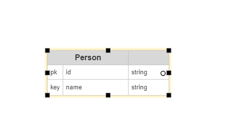
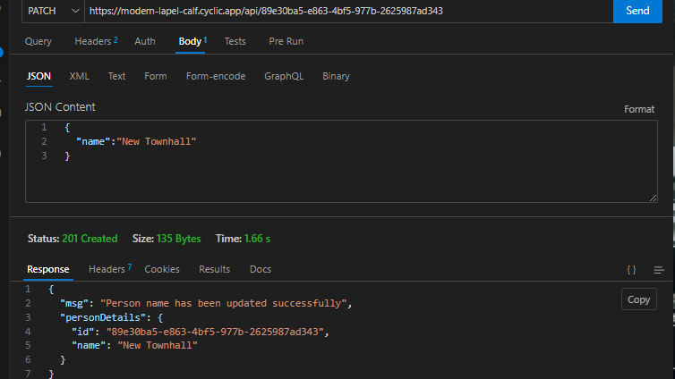

# Simple REST API capable of CRUD operations on a "person" resource.

This project provides a simple REST API for managing person records, allowing you to perform CRUD (Create, Read, Update, Delete) operations. This README.md file contains detailed instructions on setting up, running, and using the API.

> LIVE API Endpoint is https://modern-lapel-calf.cyclic.app/api/
>
> For the documentation go to [DOCUMENTATION.md](DOCUMENTATION.md)

## Table of Contents

- [Model Diagrams](#model-diagrams)
- [Prerequisites](#prerequisites)
- [Getting Started](#getting-started)
  - [1. Clone the Repository](#1-clone-the-repository)
  - [2. Install Dependencies](#2-install-dependencies)
  - [3. Run the API Locally](#3-run-the-api-locally)
- [API Endpoints](#api-endpoints)
- [Request/Response Formats](#requestresponse-formats)
- [Sample API Usage](#sample-api-usage)
- [Known Limitations and Assumptions](#known-limitations-and-assumptions)
- [Deployment](#deployment)

---

## Model Diagrams

- Unified Modeling Language (UML)
> 
-  Entity-Relationship Diagram (ERD)
> 

---

## Prerequisites

Before you begin, ensure you have met the following requirements:

- Nodejs and NPM.
- Git installed (for cloning the repository).
- PostgreSQL DB from any hosting provider.
- A code editor or IDE of your choice.

---

## Getting Started

Follow these steps to set up and run the API locally.

### 1. Clone the Repository

Clone this repository to your local machine:

```bash
git clone https://github.com/Ayothgod/backend-task.git
cd backend-task
```

### 2. Install Dependencies

Install the required Python dependencies using `npm`:

```bash
npm install
```

This will install ExpressJs, Prisma, Nodemon and all other necessary packages.

### 3. Create a .env file and add your database url.

To create a .env file, you can you the following command:

```bash
touch .env
```

### 4. Run the API Locally

To run the API locally, use the following command:

```bash
npm start
```

This will start the API server, and it will be available at `http://localhost:3001`.

---

## API Endpoints

The API provides the following endpoints for CRUD operations on the "Person" resource:

- **Create a Person**:
  - **POST  /api/**
  - Add a new person to the database.

- **Read a Person**:
  - **GET  /api/{user_id}** 
  - Retrieve details of a person by user_id.

- **Update a Person**:
  - **PUT  /api/{user_id}**
  - Modify details of an existing person by user_id.

- **Delete a Person**:
  - **DELETE  /api/{user_id}**
  - Remove a person from the database by user_id.

---

## Request/Response Formats

### Create a Person (POST /api/)

**Request Format:**

```json
{
  "name": "Ayomide Adebisi"
}
```

**Response Format (Success - 201):**

```json
{
  "msg": "Person with name: 'Townhall' has been created successfully",
  "personDetails": {
    "id": "53d8541b-7b95-4ff9-9537-88cc4443ab5c",
    "name": "Townhall"
  }
}
```

### Read a Person (GET /api/{user_id})

**Response Format (Success - 201):**

```json
 No need to add a json body to retrieve a person.

 {
  "msg": "Person with name: 'Townhall' has been returned successfully",
  "personDetails": {
    "id": "53d8541b-7b95-4ff9-9537-88cc4443ab5c",
    "name": "Townhall"
  }
}
```

**Response Format (Not Found - 404):**

```json
{
  "msg": "Wrong credentials! check and try again."
}
```

### Update a Person (PUT /api/{user_id})

**Request Format:**

```json
{
  "name":"New Townhall"
}
```

**Response Format (Success - 200):**

```json
{
  "msg": "Person name has been updated successfully",
  "personDetails": {
    "id": "53d8541b-7b95-4ff9-9537-88cc4443ab5c",
    "name": "New Townhall"
  }
}
```

**Response Format (Not Found - 400):**

```json
{
  "detail": "Person with 'New Townhall' already exists, try another name."
}
```

### Delete a Person (DELETE /api/{name})

**Response Format (Success - 201):**

```json
{
  "msg": "Person name has been deleted successfully",
  "personDetails": {
    "id": "53d8541b-7b95-4ff9-9537-88cc4443ab5c"
  }
}
```

**Response Format (Not Found - 404):**

```json
{
  "detail": "Person no longer exists"
}
```

---

## Sample API Usage

Here are some sample API usage scenarios:

1. **Create a Person**:

-  Sample post request
> 

2. **Read a Person**:

-  Sample get request
> 

3. **Update a Person**:

-  Sample update request
> 

4. **Delete a Person**:

-  Sample delete request
> 

---

## Known Limitations and Assumptions

- This API uses Prisma ORM for database query and mutation and so can be a bit slow to start up.
- Input validation is checked on only name property, so if there is more properties to add, you shold add more validation.
- Authentication and authorization mechanisms are not implemented here. Ensure secure access to your API in a real-world scenario.
- This documentation assumes that you have successfully set up the API locally.

---

## Deployment

To deploy this API to a production server, follow the appropriate deployment practices for ExpressJS and PostgreSQL applications. Ensure proper security measures, such as using HTTPS, implementing authentication, database, and securing sensitive data.

